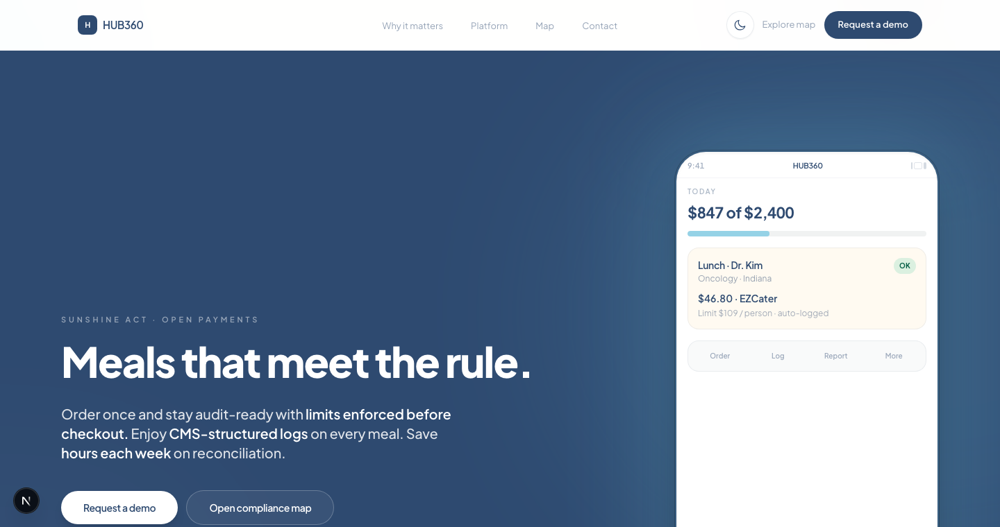
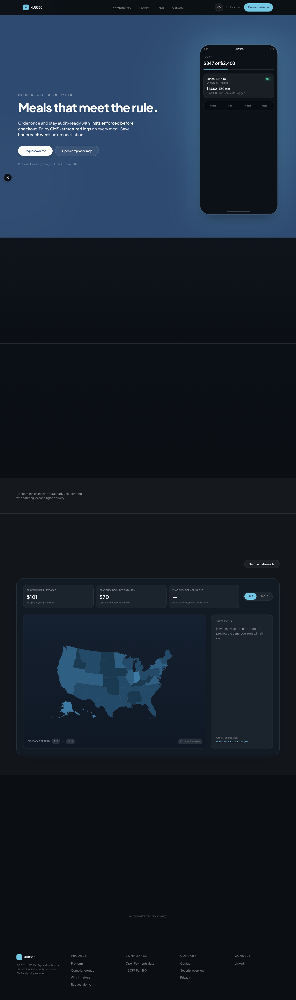

# HUB360 Website

Marketing site for **HUB360**—Sunshine Act and CMS Open Payments–aware meal ordering for healthcare teams. Built with Next.js 15, Tailwind CSS, and a compliance-focused narrative (hero, risk story, platform bento, integrations, interactive U.S. map, pilot CTA).





## Highlights

- **Letters-style hero** on brand ink (`#2E4A70`) with tight typography, strong subcopy, and an iPhone product mockup (light/dark aware).
- **Compliance visualizer** with `react-simple-maps`, state-level data, and projection tuned for the lower 48.
- **Light / dark theme** via `next-themes` (`hub360-theme` storage key), ambient background, and optional cursor spotlight.
- **Palette**: ink `#2E4A70`, accent `#73C7E3`, cream `#FFF9F0`, mist `#F0F2F2`.

For a section-by-section walkthrough, see **[docs/OVERVIEW.md](docs/OVERVIEW.md)**.

## Requirements

- Node.js 20+ (LTS recommended)
- npm 10+

## Getting started

```bash
npm install
npm run dev
```

Open [http://localhost:3000](http://localhost:3000).

```bash
npm run build   # production build
npm run start   # serve .next (after build)
npm run lint
```

## Screenshots (regenerate)

Full-page captures are committed under `docs/screenshots/`. To refresh them after UI changes:

1. Install dependencies (includes Playwright).
2. In one terminal: `npm run dev` (default port **3000**).
3. In another: `npm run screenshots`.

```bash
npm install
npx playwright install chromium   # first machine only; needed for screenshots
npm run dev                       # terminal A (default http://127.0.0.1:3000)
npm run screenshots               # terminal B
```

If Next.js picks another port (for example **3002**), point the script at it:

```bash
SCREENSHOT_URL=http://127.0.0.1:3002 npm run screenshots
```

## Repository layout

| Path | Purpose |
|------|---------|
| `app/` | Next.js App Router (`layout.tsx`, `page.tsx`, globals) |
| `components/` | Sections, nav, footer, map, phone mockup, theme providers |
| `data/` | Compliance copy keyed by state (`stateCompliance.ts`, GeoJSON topo helpers) |
| `docs/` | Overview, screenshots, doc index |
| `scripts/` | Playwright capture script |

## Tech stack

- [Next.js 15](https://nextjs.org/) (App Router)
- [React 18](https://react.dev/)
- [Tailwind CSS 3](https://tailwindcss.com/)
- [Framer Motion](https://www.framer.com/motion/)
- [next-themes](https://github.com/pacocoursey/next-themes)
- [react-simple-maps](https://www.react-simple-maps.io/) + [us-atlas](https://github.com/topojson/us-atlas)

## GitHub

The project is committed on branch **`main`** in a local repository inside this directory.

After a one-time login (`gh auth login`), publish the repo and push in one step:

```bash
npm run publish:github
```

More detail and a manual flow without the script: **[docs/GITHUB.md](docs/GITHUB.md)**.

## License

Private / all rights reserved unless otherwise specified by the project owner.
